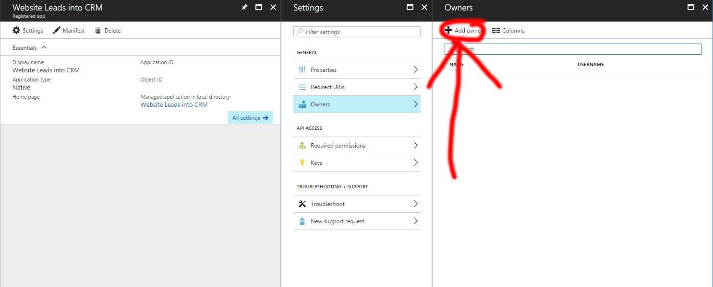

# Microsoft Dynamics CRM API dynamics SilverStripe 

**Register your Azure application to communicate with CRM**
1. Create a user account in your Microsoft 365 environment to be used as the token generator for your web application (e.g. webtoken@your_organisation.onmicrosoft.com).
2. Add the user account to Dynamics 365 preferably with full permissions.
3. In Microsoft Azure Active Directory, create a Native Application in the App Registrations area.

4. Within your Native Application, go to Owners and add the user account

5. Within your Native Application, go to 'Required permissions' and add 'Dynamics CRM Online'. You must then go to Dynamics' Delegated Permissions and check 'Access CRM Online as organization users'.

6. Within your Native Application, go to 'Keys' and generate a new key. Be sure to save the generated value somewhere for later use.

7. You should now have everything you need to use the CRM module.

==================

**Add your application details into crm.yml**

Create a mysite/_config/crm.yml file and add the following:

	---
	Name: CRM
	---
	CRMConnection:
	  username: webtoken@your_organisation.onmicrosoft.com
	  password: XXXXXXXX // Microsoft account password
	  client_secret: XXXXXXXXXXXXXXXXXXXXXXXXXXXXXXX
	  client_id: xxxxxxx-xxxx-xxxx-xxxx-xxxxxxxxxxxx
	  locationTest: https://your_test_organisation.crm5.dynamics.com
	  locationDev: https://your_dev_organisation.crm5.dynamics.com
	  locationLive: https://your_organisation.crm5.dynamics.com

==================

**Use the Microsoft Dynamics 365 Web API**

https://msdn.microsoft.com/en-us/library/mt593051.aspx

==================

**Examples**

Post data to CRM
```php
	try {
	  CRM::request(
	    'https://your_organisation.crm5.dynamics.com/api/data/v8.2/leads',
	    'POST',
	    array(
	      "subject" => "Website Enquiry",
	      "emailaddress1" => $do->YourEmail,
	      "firstname" => $do->YourName,
	      "jobtitle" => $do->Message
	    )
	  );
	} catch ( Exception $e) {
	  throw new SS_HTTPResponse_Exception('failure to connect to crm: '.$e->getMessage());
	}
```

Retrieve data from CRM - return only firstname and lastname - only return the first 3 pages
```php
	try {
	  CRM::request(
	    'https://your_organisation.crm5.dynamics.com/api/data/v8.2/leads?$select=firstname,leadid',
	    'GET',
	    array(),
	    array('Prefer: odata.maxpagesize=3')
	  );
	} catch ( Exception $e) {
	    throw new SS_HTTPResponse_Exception('failure to connect to crm: '.$e->getMessage());
	}
```

Update a object's fields by ID
```php
	try {
	  CRM::request(
	    'https://your_organisation.crm5.dynamics.com/api/data/v8.2/leads(bf830ffd-2047-e711-8105-70106fa91921)',
	    'PATCH',
	    array(
	      "subject" => "123 Website Enquiry",
	      "email  address1" => $do->YourEmail,
	      "firstname" => $do->YourName,
	      "jobtitle" => $do->Message
	    )
	  );
	} catch ( Exception $e) {
	  throw new SS_HTTPResponse_Exception('failure to connect to crm: '.$e->getMessage());
	}
```

Update an individual field for a object by ID
```php
	try {
	  CRM::request(
	    'https://your_organisation.crm5.dynamics.com/api/data/v8.2/leads(bf830ffd-2047-e711-8105-70106fa91921)/subject',
	    'PUT',
	    array(
	      "value" => "321 Website Enquiry"
	    )
	  );
	} catch ( Exception $e) {
	  throw new SS_HTTPResponse_Exception('failure to connect to crm: '.$e->getMessage());
	}
```

Delete a object by ID
```php
	try {
	  CRM::request(
	    'https://your_organisation.crm5.dynamics.com/api/data/v8.2/leads(bf830ffd-2047-e711-8105-70106fa91921)',
	    'DELETE'
	  );
	} catch ( Exception $e) {
	  throw new SS_HTTPResponse_Exception('failure to connect to crm: '.$e->getMessage());
	}
```